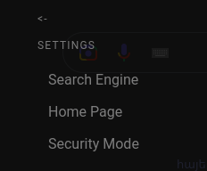

# Home Page

To change your home page, click on the **Menu** button, go to **Settings**, then **Home Page.** And choose your home page:

<figure><figcaption></figcaption></figure>

### Custom Home:

We don't currently support custom home pages. If you want to have a custom home page you'll have to do it manually. If you think that's an important feature, open an issue on [GitHub](https://github.com/PocketStudios/Pocket-Browser/issues).

* Open your file manager.
* Go to the browser configuration folder:

**Windows:** C:\Users\\{User}\AppData\Local\pocket-browser\\

**Linux:** \~/.config/pocket-browser

**Mac:** \~/Library/Application Support/pocket-browser

* Open the `home.pocket`file.
* Put the home page link.
* Restart the browser.

